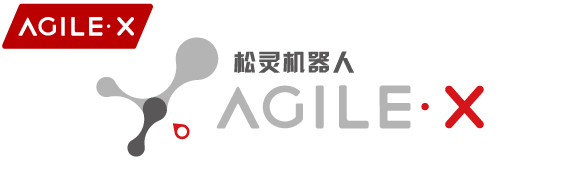

AgileX Robotics is a leading mobile robot chassis manufacturer and autonomous robot solution provider，building the best robot development platform for education，Research institutions, companies，robot startups, etc. The company has developed a full line-up of industry-leading robotics chassis, comprising general UGV, indoor AGV, tracked chassis, as well as provides robot R&D kits, mobile manipulator kit, autopilot kit and more. To cooperate with over 1000 enterprises like Alibaba, Huawei, Honda, and over 100  top global universities, AgileX Robotics has deployed more than 1000 applications in full industries including unmanned delivery, agriculture management, geographic surveying, industry inspection，etc.

Open source projects

| Title                        | Description                                                  |
| ---------------------------- | ------------------------------------------------------------ |
| AgileX-Robotics-user-manuals | The user manuals for all agilex chassis can be found [here](https://global.agilex.ai/pages/manual). |
| UGV_GAZEBO_SIM               | The Gazebo simulation and URDF models for the chassis can be found [here](https://github.com/agilexrobotics/ugv_gazebo_sim). |
| UGV_SDK                      | The [UGV_SDK](https://github.com/agilexrobotics/ugv_sdk) for chassis development is available in C++ and can be used in Linux、Windows. |
| ROS1 DRIVER                  | The ROS1 driver packages for the chassis include the [Scout](https://github.com/agilexrobotics/scout_ros) series, [Hunter](https://github.com/agilexrobotics/hunter_ros) series, [Bunker](https://github.com/agilexrobotics/bunker_ros) series,[Tracer](https://github.com/agilexrobotics/tracer_ros) series, [Limo](https://github.com/agilexrobotics/limo_ros) series, and [Ranger](https://github.com/agilexrobotics/ranger_ros) series. |
| ROS2 DRIVER                  | The ROS2 driver packages for the chassis include the [Scout](https://github.com/agilexrobotics/scout_ros2) series, [Hunter](https://github.com/agilexrobotics/hunter_ros2) series, [Bunker](https://github.com/agilexrobotics/bunker_ros2) series, [Tracer](https://github.com/agilexrobotics/tracer_ros2) series, [Limo](https://github.com/agilexrobotics/limo_ros2) series, and [Ranger](https://github.com/agilexrobotics/ranger_ros2) series. |
| LIMO SERIES                  | The user manuals for the Limo series products, including [Limo](https://github.com/agilexrobotics/limo-doc), [Limo Pro](https://github.com/agilexrobotics/limo_pro_doc), and [Limo ROS2](https://github.com/agilexrobotics/limo_ros2_doc),as well as the [Limo Cobot](https://github.com/agilexrobotics/limo_cobot_sim) Gazebo simulation, are available here. |
| PIPER SERIES                 | The SDK for the [Piper robotic arm](https://github.com/agilexrobotics/piper_sdk), the [Piper ROS driver package](https://github.com/agilexrobotics/Piper_ros), and [development demos](https://github.com/agilexrobotics/piper_sdk_demo) are available here. |
| MOBILE_ALOHA                 | The code implementation for [AGILEX MOBILE_ALOHA](https://github.com/agilexrobotics/mobile-aloha) and various simulations for [MOBILE_ALOHA](https://github.com/agilexrobotics/mobile_aloha_sim) are available here. |
| COBOT SERIES                 | The Gazebo simulations for the Cobot series, including [Cobot Scout](https://github.com/agilexrobotics/scout_cobot_sim) and [Cobot S](https://github.com/agilexrobotics/cobot_s_sim), are available here. |
| NAVIS                        | The API usage demos for the [NAVIS](https://github.com/agilexrobotics/Navis) navigation system are available here. Development is primarily done on Ubuntu 18.04, and Windows is not supported. |
| LIFTING                      | The usage instructions for the Agilex lifting pole, along with the [ROS1](https://github.com/agilexrobotics/lifting_ws) and [ROS2](https://github.com/agilexrobotics/lifting_ws_ros2) driver code, are available here. |

